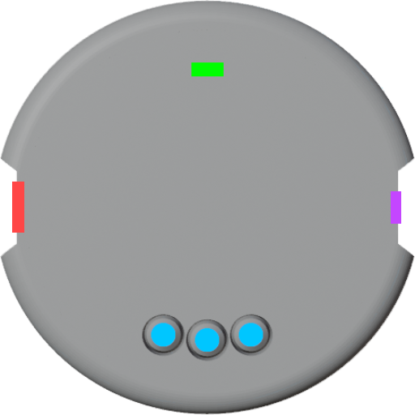

# Chromadeck

Welcome to the Chromadeck Guide, this page covers the basic features of the Chromadeck.

On the front of the Chromadeck are three <strong style="color: #00c6ff">navigation buttons</strong>, and a small <strong style="color: #00ff00;">power switch</strong>.

On the notched left side of the Chromadeck is a <strong style="color: #ff4646;">USB-C Port</strong> for charging and PC connectivity.  On the opposite notch is the <strong style="color: #c446ff;">Chromalink Port</strong>.

## The Chromalink

The [Chromalink](the_chromalink.html) is the primary accessory of the Chromadeck that enables programming the [Duo Light](duo_guide.html).

## Basic Usage

When the Chromadeck is not connected to the PC it can be used just like any other Vortex Device, it can play modes and offers the same menus as other devices.

When the Chromadeck is first powered on it will display a rainbow gradient around it's leds, this is the one special part about a Chromadeck that no other device has known as **Profile Selection**.

### Profile Selection

- When powered on, the Chromadeck will always begin with profile selection. 
- The Chromadeck has 10 profiles, each with 14 mode slots. 

### Buttons
- First use the left and right navigation buttons to highlight a profile, and the middle button to select it. 
- Short click the left and right navigation buttons to cycle through the 14 modes slots of the select profile.
- Navigate to a mode then hold the navigation button until the lights flash white to open the menus.

## Menus

Once the menus are open, use short clicks to cycle through the following menu options, long click to enter a menu.



<a href="randomizer_menu.html">
  
Randomizer

</a>

<a href="mode_sharing_menu.html">
  
Mode Sharing

</a>

<a href="color_select_menu.html">
  
Color Select

</a>

<a href="pattern_select_menu.html">
  
Pattern Select

</a>

<a href="global_brightness_menu.html">
  
Global Brightness

</a>

<a href="factory_reset_menu.html">
  
Factory Reset

</a>



---

## Next Steps

  <ul>
    <li><a href="basic_usage.html">Explore Vortex Engine</a>: Learn key terms, concepts, and how to use on-device menus.</li>
    <li><a href="chromadeck_upgrade_guide.html">Upgrade Your Device</a>: Ensure your device has the latest firmware for optimal performance.</li>
  </ul>

---

If you have any questions or need further assistance, check out the [Support Page](support.html).
