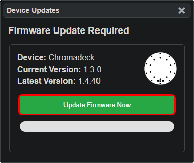

# Chromadeck Upgrade Guide

This page details how to update the firmware on the Vortex Chromadeck.

It is important to keep the Chromadeck up to date to avoid bugs and use the latest safety fixes.

- **Use a data-capable USB cable, power-only cables won't work.**
- Windows will notify upon successful connection
- Mac may work but is not officially supported.

First, navigate a **Google Chrome** browser to https://lightshow.lol

 - With the Chromadeck plugged in via USB, click the 'Connect Device' USB icon:

  

 - Chrome will popup a new window, select 'USB JTAG/serial debug unit' from the list

  

 - Once the chromadeck is connected the UI should look like this, simply hit 'Update Firmware Now' in the Device Updates panel:

  
<b>NOTE</b>: Ignore the 'Update Firmware' button in the Chromalink Duo panel!

  

  

 - Let the firmware flash complete, unplug the Chromadeck, then flip the power switch to check that it turns on
 
 - Cycle through all of the modes to verify the flash was successful

## Troubleshooting

**It doesn't work!**  
If you encounter any other issues, try refreshing to page and unplugging and reconnecting your chromadeck. Also make sure the power switch is in the ON position while it is plugged in.

**It still doesn't work!**  
Join our [discord](https://discord.gg/4R9at8S8Sn) and ask for help!