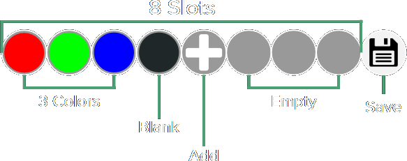

# Color Select

The Color Select menu allows customization of the colors in the current [Mode](mode.html). This collection of colors is commonly referred to as a [Colorset](colorsets.html).

## Try It Yourself

Below is an interactive colorset that mimics real color select menu functionality, you can **click to add/edit** colors and **hold to delete** colors.

    

    

    

    

    

    

    

    

## Adding or Editing a Color
The **add** option will appear as a blinking white light on the first empty slot as long as the colorset isn't full.

To add a new color select the **add** option, to edit a color select just select the color itself.

### Choosing Colors

  

      

      

      

      

      1. **Select Hue Quadrant**: Pick which quadrant contains the desired hue.
  

  

      

      

      

      

      2. **Select Hue**: Pick the specific hue to decide the base color.
  

  

      

      

      

      

      3. **Select Saturation**: Pick the saturation to adjust how white the color appears.
  

  

      

      

      

      

      4. **Select Brightness**: Pick the brightness to adjust how dark the color appears.
  

After selecting brightness the menu will go back to the slot selection and reflect the new choice.

## Deleting Colors

To **delete** a color:
 1. cycle to the color slot
 2. **hold** the button until the LED glows red
 3. release the button **while the LED is red**

**Warning**: If all colors are deleted, the mode will not display anything and appear as if the device is off.

## Saving

The **save** option always appears at the end, selecting this option will save the changes and exit the menu.

You can always exit **without** saving by turning the device off.