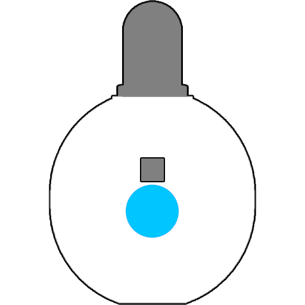

# Duo Guide

Welcome to the Duo LED Guide, this page aims to get you up and running as fast as possible.

---

## Basic Operation

  The Duo has one navigation button, this button also acts as the <strong style="color: #00ff00;">power switch</strong>.

**Powering On**

- Click the button to power on the Duo.

**Powering Off**

- Hold the navigation button and release when the lights go out to power off the Duo.

**Special Functions**

- The Duo has some unique <a href="duo_special_functions_guide.html">Special Functions
</a>. Check out the basic menus before diving into these options.

**Navigating Modes**

- Short click the navigation button to forward through the 9 available modes.

**Open Menus**
- To open the menus, navigate to a mode then hold the navigation button until the lights flash white.

**Navigating Menus**
- After opening the menus, use short clicks to cycle through the following menu options, long click to enter a menu.
---

## Menus

Each menu can be used to control your device in different ways. 



<a href="randomizer_menu.html">
  
Randomizer

</a>

<a href="mode_sharing_menu.html">
  
Mode Sharing

</a>

<a href="color_select_menu.html">
  
Color Select

</a>

<a href="pattern_select_menu.html">
  
Pattern Select

</a>

<a href="global_brightness_menu.html">
  
Global Brightness

</a>

<a href="factory_reset_menu.html">
  
Factory Reset

</a>



---

## Next Steps

  <ul>
    <li><a href="basic_usage.html">Explore Vortex Engine Usage</a>: Learn key terms, concepts, and how to use on-device menus.</li>
    <li><a href="upgrade_guides.html">Upgrade Your Device</a>: Ensure your device has the latest firmware for optimal performance.</li>
    <li><a href="guides.html">Quick Guides</a>: Jump right in with step-by-step instructions for using your Duo.</li>
  </ul>

---

If you have any questions or need further assistance, check out the [Support Page](support.html).

