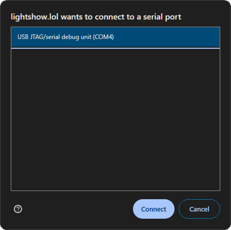
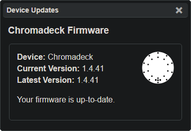

# Programming the Duo

It is important the Duo is up to date before programming from the PC. Make sure to [update the Duo](duo_upgrade_guide.html) before continuing with this guide.

 - Make sure the Duo is seated in the Chromalink, the link is connected to the Chromadeck, and the Chromadeck is plugged in and turned on

{: .note }
At the time of writing this **Chrome**, **Edge** and **Opera** are the only supported browsers, other browsers may work in the future if they gain support for <a href="https://developer.mozilla.org/en-US/docs/Web/API/Web_Serial_API#browser_compatibility">WebSerial</a>

 - Navigate a supported browser to [lightshow.lol](https://lightshow.lol) and click the **Connect Device** USB icon:

 - Chrome will open a new popup window, select **USB JTAG/serial debug unit** from the list

  

 - With the **Chromadeck** connected, two new panels will appear: **Device Updates** & **Chromalink Duo**

 
  
  

 - If you haven't <a href="chromadeck_upgrade_guide.html">updated the Chromadeck</a> yet, do it <b style="color:white;">now</b>!
 
 - If the **Chromadeck** is up to date, then press the **Update Firmware** button in the **Chromalink Duo Panel**:

# Connecting the Chromalink

Hit the 'Connect Duo' button in the Chromalink window and it should load information about the Duo like the version and number of modes.

Check out the [Lightshow.lol Guide](lightshow_lol.html) to see all the awesome things you can do from here!

  
<b style="color: white;">Congratulations</b> on programming the Duo from the PC, continue reading to reassemble the Duo

# Duo Reassembly

- Remove the **Duo** from the **Chromalink** and reconnect the battery. Make sure the corners of the connector are flush for a reliable connection.
- Click the button to power on the Duo and verify the battery is fully connected, if it doesn't work then check the battery connector.

  
  

---

# Troubleshooting

**The Duo doesn't turn on**  
Make sure the duo was properly seated into the Chromalink.

**It doesn't work!**  
If you encounter any issues, try refreshing the page and unplugging and reconnecting your chromadeck. Also make sure the power switch is in the ON position while it is plugged in.

**It still doesn't work!**  
Join our [discord](https://discord.gg/4R9at8S8Sn) and ask for help!

---

## Reassembly
Once you've finished editing your modes, make sure you [put everything back together](duo_reassembly_guide.html).

