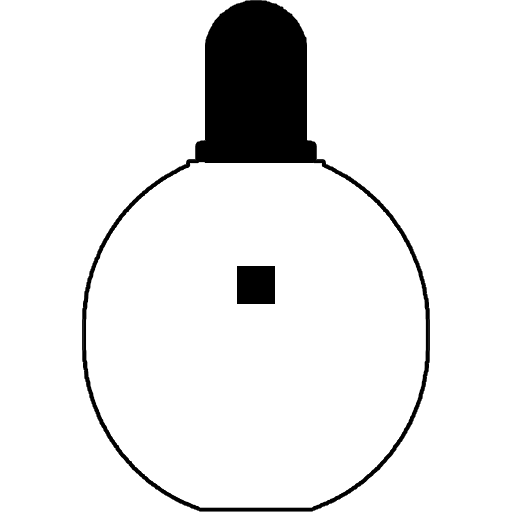

# Duo Programming Guide

There are two recommended methods for programming Duos. Which method is best depends on how many modes you want to update and whether you want to change the total number of modes.

## Choosing a Programming Method

### Wireless Programming (Recommended for Most Cases)

If your goal is to replace only a few modes on your Duo, wireless programming is the fastest and easiest option.

With wireless programming, a mode is transmitted from a Chromadeck to a Duo using the built-in Mode Sharing system. This allows you to update individual modes without removing the Duo casing or its battery.

Wireless programming is the only option if you are using an Android device with your Chromadeck.

**Recommended when:**

- Replacing only one or a few modes
- Making quick updates on-the-go
- Programming Duos frequently
- You do not want to disassemble the Duo
- No access to a PC

### Chromalink Programming

Chromalink programming allows Lightshow.lol to directly read and write the Duo's memory through a Chromalink cable connected to a Chromadeck.

This method is ideal when replacing all nine modes on a Duo. This is also the only way to adjust the total number of modes on the Duo (1 to 9).

Because the Duo must be removed from its sleeve and disconnected from its battery before being inserted into the Chromalink holder, this process carries some risk and takes more preparation than wireless programming. The battery connector can be somewhat delicate, so unnecessary disassembly is not recommended.

Chromalink programming is unavailable when connecting to the Chromadeck via Bluetooth on your Android device.

Therefore the only time Chromalink programming is recommended is when you are replacing all 9 modes on the device, performing firmware updates, or adjusting the total number of modes.

**Recommended when:**

- Replacing all nine modes
- Completely reorganizing your mode list
- Programming many Duos with the same list of modes
- Performing firmware updates
- Reducing total number of modes

---

# Wireless Programming

Wireless programming uses the Duo's built-in Mode Sharing feature.

There are two ways to send a mode wirelessly:

1. Send a mode already on your Chromadeck with the built-in modesharing menu on the Chromadeck
2. Use Lightshow.lol with a connected Chromadeck and transmit directly from the website.

To use the Chromadeck's built-in mode-sharing menu just enter it's menu in the exact same way you would the Duo.

To use lightshow.lol and wirelessly transfer, continue reading the next section.

In either case, only a single mode is transferred at a time.

## Lightshow.lol on PC

Unfortunately only browsers which offer the "Web Serial" feature can connect to the Chromadeck, at this point in time only Google Chrome and a few other browsers are supported. See [browser compatibility here](https://developer.mozilla.org/en-US/docs/Web/API/Web_Serial_API#browser_compatibility)

If you have never connected your Chromadeck to lightshow.lol before, follow [this guide](https://stoneorbits.github.io/VortexEngine/chromadeck_upgrade_guide.html) to get started then return here.

To program a new mode from lightshow.lol on PC follow these steps:

1. Connect your Chromadeck to Lightshow.lol.
2. Select the mode you want to transfer in the mode list (import, edit, or create one).
3. Open the Duo's Mode Sharing menu making sure it is ready to receive
4. Point the Chromadecks leds toward the Duo receiver (button area)
5. While pointing the Chromadeck at the Duo, press the **Transmit** button in the upper-right corner of the Modes Panel on Lightshow.lol.
5. Wait for the transfer to complete or repeat from step 4 if it fails.

The selected mode will be sent directly from lightshow.lol, through the Chromadeck, then wirelessly to the Duo.

This can be done with multiple Duos at the same time

## Lightshow.lol on Android

Lightshow.lol can also connect to a Chromadeck over Bluetooth from supported Android devices.

This allows you to:

- Create and edit modes on your Android device
- Send modes to the Chromadeck
- Wirelessly transfer those modes to a Duo through Mode Sharing

The process is similar to the PC approach outlined above, and the mobile layout of lightshow.lol is quite straight forward.

---

# Chromalink Programming

Chromalink programming provides direct access to the Duo's memory.

Instead of transferring one mode at a time, Lightshow.lol can push or pull an entire list of modes in a single operation.

This is the fastest method when replacing all nine modes on a Duo, but it carries risk because the Duo was not designed to be unwrapped or disconnected from it's battery repeatedly.

Always use caution when unwrapping the Duo and be sure to follow the [Duo Chromalink Guide](https://stoneorbits.github.io/VortexEngine/duo_chromalink_guide.html) to unwrap your Duo and disconnect the battery safely.

## Preparing the Duo

Before connecting a Duo through Chromalink:

1. Remove the Duo from its sleeve or case.
2. **Disconnect the battery.**
3. Insert the Duo into the Chromalink holder.
4. Connect the **Chromadeck** to Lightshow.lol.
5. In the 'Chromalink Duo' panel click *Connect Duo*

## Programming Modes

With the Duo connected through Chromalink, you can:

- Read all modes from the Duo
- Replace all modes at once
- Reorder modes
- Reduce the total number of stored modes
- Quickly duplicate the same mode list onto multiple Duos

## Programming Multiple Duos Quickly

If you are programming several Duos with the same set of modes, there is a useful shortcut:

Note, all Duos *MUST* be the same version number for this trick to work!

1. Connect the first Duo through Chromalink.
2. Push your desired mode list.
3. **Do not press "Disconnect Duo".**
4. Remove the programmed Duo from the Chromalink.
5. Insert the next Duo.
6. Press **Push Modes** again.

Lightshow.lol will continue using the existing list of modes allowing you to rapidly program multiple Duos with the same mode list without reconnecting each one individually.

Hitting the Disconnect Duo button would normally clear the mode list as it reverts back to the Chromadeck connection.

This the fastest ways to prepare a large number of Duos with a full custom mode list.

---

# Learning the Click Interface

Even if you primarily use Lightshow.lol, it is worth learning the Duo's click-based programming interface.

The click interface is largely consistent across Stone Orbits devices, including the Chromadeck and other compatible products.

Once you learn how to navigate the menus and programming options on one device, you will already be familiar with most of the controls on the others.
