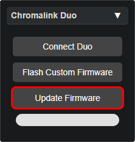
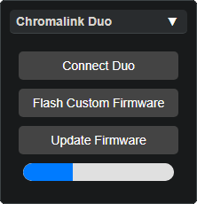

# Updating Your Duo

 - Navigate a **Google Chrome** browser to [lightshow.lol](https://lightshow.lol) and click the **Connect Device** USB icon:

  
<b>Note:</b>
  Other browsers may work if they support <a href="https://developer.mozilla.org/en-US/docs/Web/API/Web_Serial_API#browser_compatibility">WebSerial</a>

  

 - Chrome will open a new popup window, select **USB JTAG/serial debug unit** from the list

  

 - With the **Chromadeck** connected to lightshow.lol, two new panels will be visible: **Device Updates** & **Chromalink Duo**

{: .note }
<b style="color:white;">Note: </b> If you haven't <a href="chromadeck_upgrade_guide.html">updated the Chromadeck</a> yet, do it <b style="color:white;">now</b>!

 
  
  

 
- If the **Chromadeck** firmware is up to date, then press the **Update Firmware** button in the **Chromalink Duo Panel** to update the Duo:

{: .note }

<b style="color: white;">Note</b>: It is unnecessary to press Connect Duo when updating Firmware!

  
  
  
  You should see the blue bar on your screen fill with progress and your Chromadeck will fill with green LEDs to represent the progress as well.

 - Let the flash complete.

 - After completion, pressing the button should turn the Duo on.

 - If it powers on successfully, proceed to the next step or go to the [Chromalink Guide](chromalink_guide.html) to see how to use your Duo with Lightshow.lol
 

  
<b style="color: white;">Congratulations</b> You have successfully updated the Duo Firmware!

 ---

# Troubleshooting

**The Duo doesn't turn on**  

Repeat the process if the Duo doesn't work, make sure the duo was properly seated into the Chromalink and the progress bar in the Chromalink window fills.

**The progress bar doesn't start and the Chromadeck LEDs are yellow**  

This is a well known and common issue we are working to fix, simply remove the Duo from the Chromalink dock and put it back, the firmware flash will begin immediately.

**It doesn't work!**  

If you encounter any other issues, try refreshing the page and unplugging and reconnecting your chromadeck. Also make sure the power switch is in the ON position while it is plugged in.

**It still doesn't work!**  
Join our [discord](https://discord.gg/4R9at8S8Sn) and ask for help!