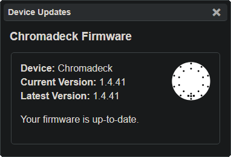

# Updating the Duo

Now that the Duo is connected to the PC via the Chromalink, follow these steps to update the Duo firmware:

 - Navigate a **Google Chrome** browser to [lightshow.lol](https://lightshow.lol) and click the **Connect Device** USB icon:

  
<b>Note:</b>
  Other browsers may work if they support <a href="https://developer.mozilla.org/en-US/docs/Web/API/Web_Serial_API#browser_compatibility">WebSerial</a>

  

 - Chrome will open a new popup window, select **USB JTAG/serial debug unit** from the list

  

 - With the **Chromadeck** connected to lightshow.lol, two new panels will be visible: **Device Updates** & **Chromalink Duo**

{: .note }
<b style="color:white;">Note: </b> If you haven't <a href="chromadeck_upgrade_guide.html">updated the Chromadeck</a> yet, do it <b style="color:white;">now</b>!

 
  
  

 
- If the **Chromadeck** firmware is up to date, then press the **Update Firmware** button in the **Chromalink Duo Panel** to update the Duo:

{: .note }

<b style="color: white;">Note</b>: It is unnecessary to press Connect Duo when updating Firmware!

  
  

  
Both the blue progress bar and the Chromadeck leds will fill as the flashing takes place

 - Let the flash complete.

 - After completion, pressing the button should turn the Duo on

 - If it powers on successfully, proceed to the next step or go to the [Programming Guide](duo_programming_guide.html) to see how to program the Duo with Lightshow.lol

# Duo Reassembly

- Remove the **Duo** from the **Chromalink** and reconnect the battery. Make sure the corners of the connector are flush for a reliable connection.
- Click the button to power on the Duo and verify the battery is fully connected, if it doesn't work then check the battery connector.

  
  

  
<b style="color: white;">Congratulations</b> The Duo firmware is now updated!

 ---

# Troubleshooting

**The Duo doesn't turn on**  

Repeat the process if the Duo doesn't work, make sure the duo was properly seated into the Chromalink and the progress bar in the Chromalink window fills.

**The progress bar doesn't start and the Chromadeck LEDs are yellow**  

This is a well known and common issue we are working to fix, simply remove the Duo from the Chromalink dock and put it back, the firmware flash will begin immediately.

**It doesn't work!**  

If you encounter any other issues, try refreshing the page and unplugging and reconnecting your chromadeck. Also make sure the power switch is in the ON position while it is plugged in.

**It still doesn't work!**  
Join our [discord](https://discord.gg/4R9at8S8Sn) and ask for help!
