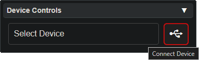

  <h1 style="color:orange;">⚠ <b style="color:red;">Warning</b> ⚠ </h1>
  <h2>Upgrading Duos <i>can</i> be dangerous! Be patient and following these steps carefully, StoneOrbits is not responsible for any damage</h2>

# Duo Upgrade Guide

To update your Duo you will need a Chromadeck and a Chromalink cable.

Before updating the Duo, connect the **Chromadeck** to the PC via USB and make sure it is [up to date](chromadeck_upgrade_guide.html)

- **Use a data-capable USB cable, power-only cables won't work.**
- Windows will notify upon successful connection
- Mac may work but is not officially supported.

 - First, plug the **Chromadeck** into the PC and connect the **Chromalink** cable to the side of the **Chromadeck**, and turn the Chromadeck power switch on
&nbsp;

 - **Gently** and **carefully** peel the Duo battery away from the Duo like shown below, failure to remove will degrade the battery

  
⚠ <b>Warning</b> ⚠ 
  Damage to the Duo or battery is not covered by warranty!

  
  

 
 - Slot the Duo into the **Chromalink** by seating it flat in the center then sliding it into place like shown below

  
  

 - **[Optional]** Turn the Duo on to verify it is connected properly

 - Navigate a **Google Chrome** browser to [lightshow.lol](https://lightshow.lol) and click the 'Connect Device' USB icon:

  

 - Chrome will open a new popup window, select **USB JTAG/serial debug unit** from the list

  

 - Now the UI should look like this, press **Update Firmware** in the **Chromalink Duo Panel**:

  <a style="color: white;"><b>NOTE</b>: It is unnecessary to press Connect Duo!</a>
  

 - Wait for the firmware flash to complete
 
 - Remove the Duo from the Chromalink and reconnect the battery
 
 - Turn the Duo on and cycle through all of it's modes to verify the flash was successful

## Troubleshooting

**The firmware flash doesn't start and the Chromadeck is yellow**  

This is a well known and common issue we are working to fix, simply remove your duo from the holder and re-seat it in the holder and the firmware flash will begin

**It doesn't work!**  

If you encounter any other issues, try refreshing to page and unplugging and reconnecting your chromadeck. Although it shouldn't be necessary, make sure the power switch is in the ON position while it is plugged in.

**It still doesn't work!**  
Join our [discord](https://discord.gg/4R9at8S8Sn) and ask for help!