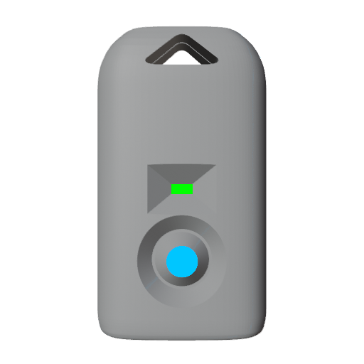

# Getting Started

If this is your first time with a Vortex Device then congratulations and welcome to the Vortex Engine tutorial.

Regardless of which device you have most devices work and function almost entirely the same.

You can expect to find navigation buttons and a small power switch on any device.

## New Devices

### 
Spark Orbit - Spark Handles - Chromadeck

  
  
  
  

### 
Duo

  

  The Duo's navigation button is also it's power switch.

## Classic Devices
### 
Omega Handles - Vortex Orbit - Vortex Gloves

  

<strong>For Omega Handles, Vortex Orbits, and Vortex Gloves,</strong> there is also a very small reset button which is primarily used for updating the device firmware.

## Next Steps

To begin learning how to use your device head over to [Basic Usage](basic_usage.html) where we will explore navigating modes, and utilizing the on-device menus.

If your device is new then it will already be up to date, but if you have an older device or would like to learn how to upgrade your device head over to [Upgrade Guides](upgrade_guides.html)

## Quick Guides

If you really just want to jump into things as fast as possible, be sure to check out the [Quick Guides](guides.html)
