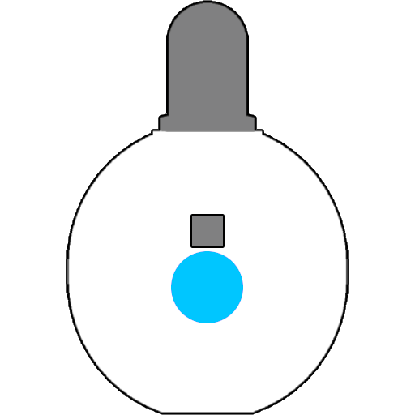

# Getting Started with the Duo

  

Welcome to the Duo! This guide will help you get started and make the most of your Duo’s features.

---

## Key Features

  The Duo’s <strong style="color: #00c6ff;">navigation button</strong> doubles as its <strong style="color: #00ff00;">power switch</strong>. Short presses navigate modes, and long presses activate menu options.

---

## Next Steps

  <ul>
    <li><a href="basic_usage.html">Explore Basic Duo Usage</a>: Learn key terms, concepts, and how to use on-device menus.</li>
    <li><a href="basic_usage.html">Explore Vortex Engine</a>: Learn key terms, concepts, and how to use on-device menus.</li>
    <li><a href="upgrade_guides.html">Upgrade Your Device</a>: Ensure your device has the latest firmware for optimal performance.</li>
    <li><a href="guides.html">Quick Guides</a>: Jump right in with step-by-step instructions for using your Duo.</li>
  </ul>

---

If you have any questions or need further assistance, check out the [Support Page](support.html).
