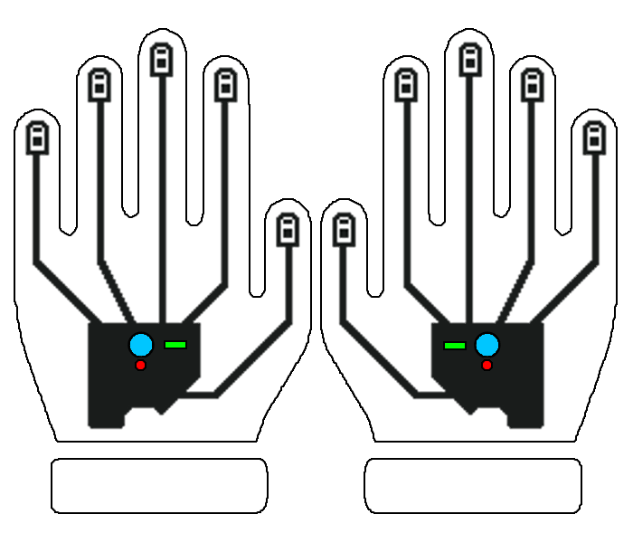

# Gloves Guide

Welcome to the Vortex Wired Gloves Guide, this page aims to get you up and running as fast as possible.

## Buttons

The gloves have one navigation button and a small power switch on each glove.

There is also a very small reset button for updating the device firmware.

## Navigating Modes

Short click the navigation button to forward through the 14 available modes.

To edit a mode, navigate to it then hold the navigation button to open the menus.

## Menus

Use short clicks to cycle through the following menu options, long click to enter a menu.



<a href="randomizer_menu.html">
  
Randomizer

</a>

<a href="mode_sharing_menu.html">
  
Mode Sharing

</a>

<a href="color_select_menu.html">
  
Color Select

</a>

<a href="pattern_select_menu.html">
  
Pattern Select

</a>

<a href="global_brightness_menu.html">
  
Global Brightness

</a>

<a href="factory_reset_menu.html">
  
Factory Reset

</a>


---
layout: default
title: Gloves Guide
nav_order: 3
parent: Guides & Tutorials
---

# Gloves Quick Use Guide

Welcome to the Vortex Gloves Quick-Use-Guide, this guide aims to get you up and running as fast as possible.

## Accessing Menus

To enter the menu:

1. **Hold the Navigation Button:** Hold the button until the LEDs alternate white blinks.
2. **Cycle Menus:** Use short clicks to cycle through menu options. The menu colors indicate their function:

    
Randomizer

    
Mode Sharing
  
    
Editor Connection

    
Color Select
  
    
Pattern Select

    
Global Brightness

    
Factory Reset

## Selecting LEDs for Colorset/Pattern/Randomization

1. **Enter the Desired Menu:** Use a long click to select.
2. **LED Selection:**
   - Short click to cycle between [LED groups](LEDgroups.html).
   - Long click to select the LED group you want to customize.
   - You can also make a [custom LED group](CustomGroups.html).

## Randomizing a Mode

1. **Select Randomizer Menu (White):**
2. **Select an LED group.**
3. **Randomize:**
   - Short click to cycle through randomizations.
   - Long click to confirm and save the randomized LEDs.

Learn more about the [Randomizer](randomizer.html).

## Changing the Colorset on a Mode

1. **Select Color Select Menu (Green):**
2. **Select an LED group.**
3. **Edit Colorset:**
   - Click to navigate through the colors in your set.
   - Long click a color to edit it.
   - Hold on a color until it flashes red to delete it.
   - Long click the slot after your colorset to add a color.
   - Select the red edge lights to save and exit.

Learn more about [Color Selection](colorSelect.html).

## Changing the Pattern on a Mode

1. **Select Pattern Select Menu (Blue):**
2. **Select an LED group.**
3. **Select Pattern:**
   - Choose one of the 4 shortcuts to enter the pattern list.
   - Cycle through patterns and long click to apply.

## Wirelessly Transferring to Another Device

1. **Select Mode Sharing Menu (Cyan):**
2. **Initiate Transfer:**
   - Short click to cycle between receive (default) and send.
   - Point the button of the sending device at the button of the receiving device.
   - The receiving device will start to glow green and play the mode once it is received.

## Connecting to the PC

To connect to PC and web applications see [Connecting to Computer](computer.html).

## Changing Global Brightness

1. **Select Global Brightness Menu (Yellow):**
2. **Adjust Brightness:**
   - Use short clicks to cycle through brightness options.
   - Long click to set.

## Factory Resetting the Device

1. **Select Factory Reset Menu (Red):**
2. **Confirm Reset:**
   - Short click to cycle between factory reset or cancel.
   - Hold the factory reset option until the device fades from red to white to reset.

