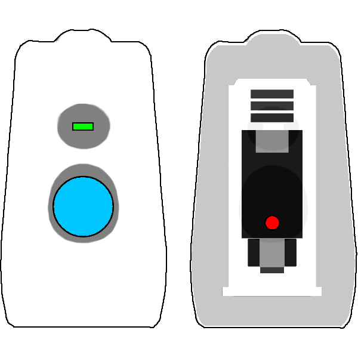
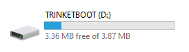

# Handle Upgrade Guide

The latest firmware for your device can be found on the Vortex Community [downloads page](https://vortex.community/downloads).

First, connect your device to the PC via USB.

- **Use a data-capable USB cable, power-only cables won't work.**
- Windows will notify upon successful connection
- Mac may work but is not officially supported.

Next, double click the  reset button as seen in the above image. A new drive should appear when successful, this may take a few tries.

  

Finally, Drag & Drop the device firmware into the Trinketboot drive to automatically upgrade.

As long as the file transfer completes, the firmware should be updated.

# Troubleshooting

**The drive doesn't show up**
Most likely you are not using a data-capable usb cable, try different usb cables and different usb ports on the PC.

**The file transfer freezes**
Some pcs have a rare issue where the file transfer will freeze, the only known workaround is to use a different PC.

**The file inside the trinketboot drive doesn't have a new name**
This is normal, copying the firmware to the drive is not like a normal file copy. Opening the drive as a folder will always show the same file.
