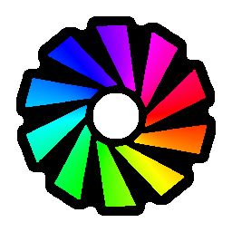
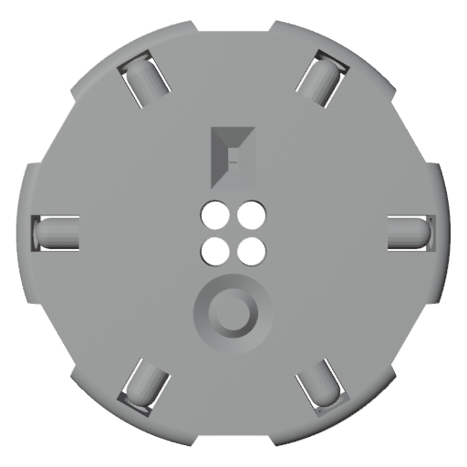
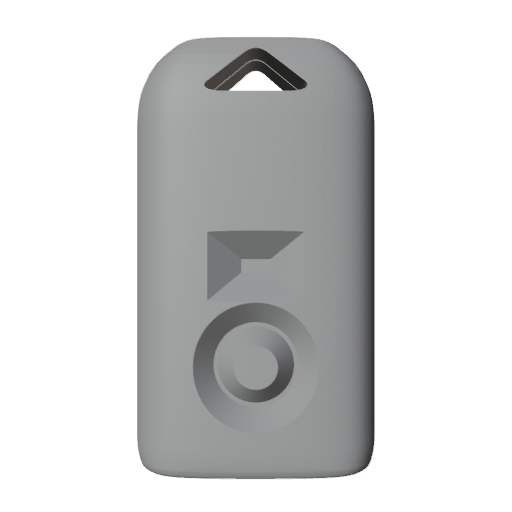

  
  <h1 style="margin: 0;">Vortex Engine</h1>

  Welcome to the Vortex Engine Wiki! Here you can find documentation and guides covering all aspects of the Vortex Engine project.

## Getting Started

Are you a new Vortex Device owner looking to get started? Follow the [Getting Started Guide](getting_started.html) for the first steps.

## Upgrade Guide

Do you already own a Vortex Device and want to upgrade it? Follow the [Vortex Engine Upgrade Guide](upgrade_guide.html)

## How Vortex Works

Are you looking to learn how Vortex Engine works and how to get the most out of your Vortex Device?

 - [Basic Usage](basic_usage.html)
 - [Menus](menus.html)
 - [Modes](modes.html)
 - [Patterns](patterns.html)
 - [Colorsets](colorsets.html)
 - [Savefiles](savefile_format.html)

 ## Online Mode Editor

 One of the geatest features of the Vortex Engine is [Lightshow.lol](lightshow.lol). This online mode editor was built using the Vortex Engine and provides an intuitive UI and precise control over your modes.

Learn more about its capabilities and features.
 [Lightshow.lol Guide](lightshow_lol.html)

## The Vortex Community and Ecosystem

All Vortex Devices can wirelessly share their configurations. This allows users to transfer modes to other devices to create matching patterns and colorsets.

Explore the official Vortex Community Hub where you can upload and share configurations and modes with friends and other lightshow artists.

[Visit Vortex Community Hub](https://vortex.community)

Join the Vortex Community Discord to share your experiences, enhance your use of the Vortex Engine, and discuss Vortex with other enthusiasts.

[Join Vortex Community Discord](https://discord.gg/4R9at8S8Sn)

  
  
  
  

