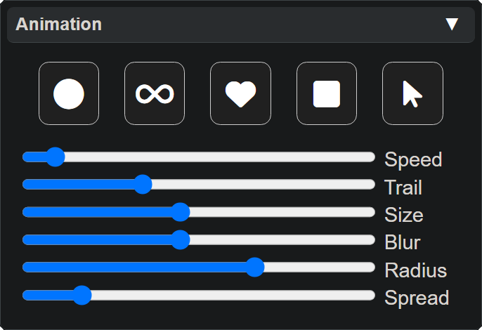

  <h1 style="color:orange;">⚠ <b style="color:yellow;">This page is under construction</b> ⚠ </h1>

# Lightshow.lol

Welcome to the Vortex Engine wiki! This page details how to use the web-based Vortex Editor [lightshow.lol](https://lightshow.lol). 

## Basics

Lightshow.lol is an online tool that allows you to design, preview, and export custom [modes](modes.html) for any Vortex devices. 

The lightshow preview is the main focus of the page, with various control panels serving to modify the pattern, colorset, and preview animation.

  <strong class="important-inline-header">Important</strong>
  Although the preview is an exact simulation of a real device, due to the difference in the way color is produced by LEDs and displays <b>the preview will never look exactly the same as real LEDs</b>.

----
<h2>Panel Breakdown</h2>

Select one of the Panels below to learn more about it

  <a href="lightshow_lol_animation.html" class="panel-link">
    🔗 Animation Panel →
    
  </a>
  <a href="lightshow_lol_device_controls.html" class="panel-link">
    🔗 Device Control →
    
  </a>
  <a href="lightshow_lol_modes.html" class="panel-link">
    🔗 Modes Panel →
    
  </a>
  <a href="lightshow_lol_led_selection.html" class="panel-link">
    🔗 Led Selection →
    
  </a>
  <a href="lightshow_lol_pattern.html" class="panel-link">
    🔗 Pattern Panel →
    
  </a>
  <a href="lightshow_lol_colorset.html" class="panel-link">
    🔗 Colorset Panel →
    
  </a>
  <a href="lightshow_lol_color_picker.html" class="panel-link">
    🔗 Color Picker →
    
  </a>

