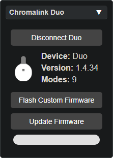

# Preview Animation

  

The **Preview** is the spinning circle of colors immediately visible when entering the page, and the **Animation Panel** specifically controls the appearance of this **Preview**.

While the **Preview** will react to changes made in various UI panels (like Pattern or Colorset), the **Animation Panel** only affects the on-screen preview, not how the actual device looks.

The five animation shape options are self-explanatory, but the six slider options in this panel are:

- **Speed**: How fast the animation progresses.
- **Trail**: How long the colors remain visible (the length of the trail).
- **Size**: The size of each blink of color.
- **Blur**: Softness/diffusion of the blink on screen.
- **Radius**: The size of the animation pattern on screen.
- **Spread**: With many LEDs, the distance between LEDs in the preview.

  
 

  <a href="lightshow_lol_chromalink_duo.html" class="panel-link">
    ← Chromalink Panel 🔗
    
  </a>
  <a href="lightshow_lol_device_controls.html" class="panel-link">
    🔗 Device Control →
    
  </a>

