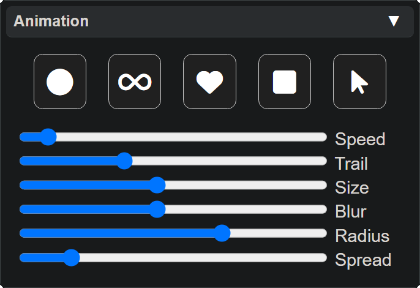
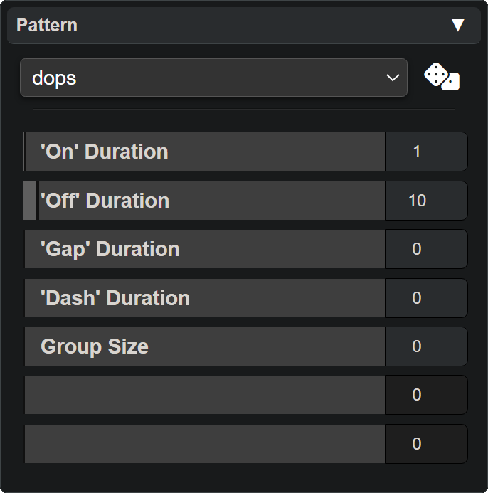
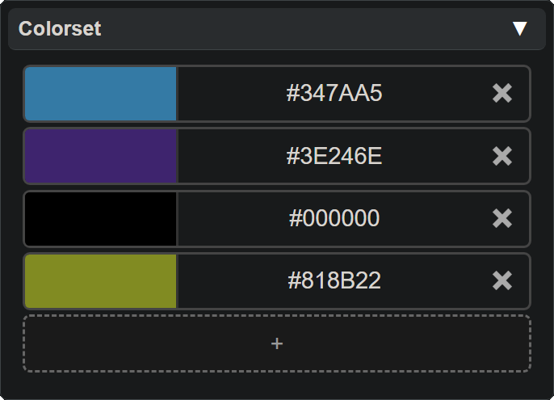
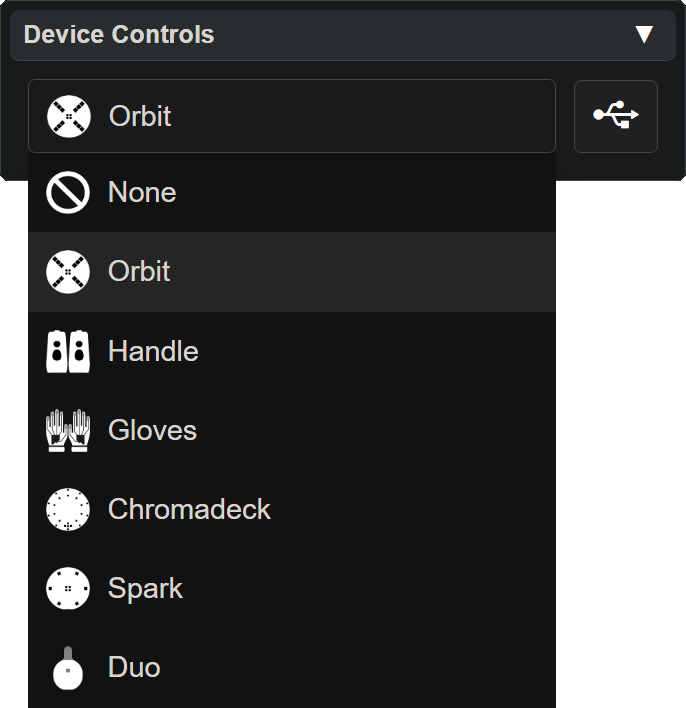
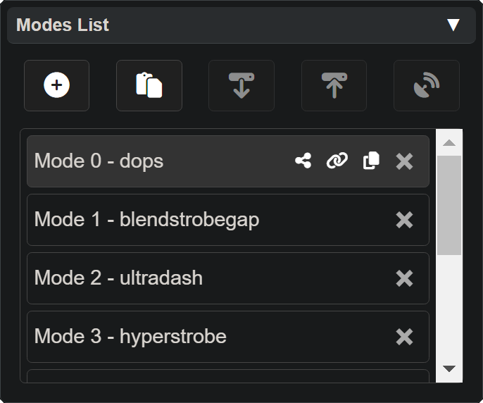
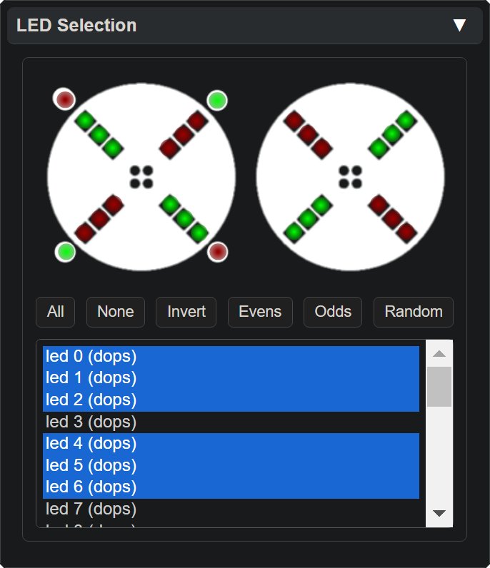

# Control Panels

Depending on whether lightshow.lol is used from **mobile** or **desktop** the layout will appear different, but will function nearly the same. 

Pick one of the panels below to learn more about it:

  <a href="lightshow_lol_animation.html" class="panel-link">
    🔗 Animation Panel →
    
  </a>
    <a href="lightshow_lol_pattern.html" class="panel-link">
    🔗 Pattern Panel →
    
  </a>
    <a href="lightshow_lol_colorset.html" class="panel-link">
    🔗 Colorset Panel →
    
  </a>
    <a href="lightshow_lol_color_picker.html" class="panel-link">
    🔗 Color Picker →
    
  </a>
  <a href="lightshow_lol_device_controls.html" class="panel-link">
    🔗 Device Control →
    
  </a>
  <a href="lightshow_lol_modes.html" class="panel-link">
    🔗 Modes Panel →
    
  </a>
  <a href="lightshow_lol_led_selection.html" class="panel-link">
    🔗 Led Selection →
    
  </a>
  <a href="lightshow_lol_update_panel.html" class="panel-link">
    🔗 Update Panel →
    
  </a>
  <a href="lightshow_lol_chromalink_duo.html" class="panel-link">
    🔗 Chromalink Panel →
    
  </a>

