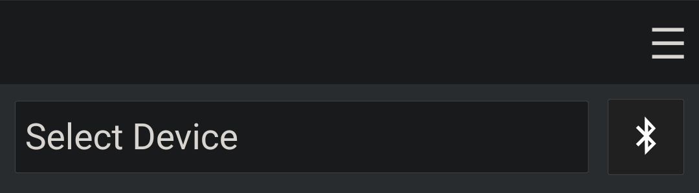
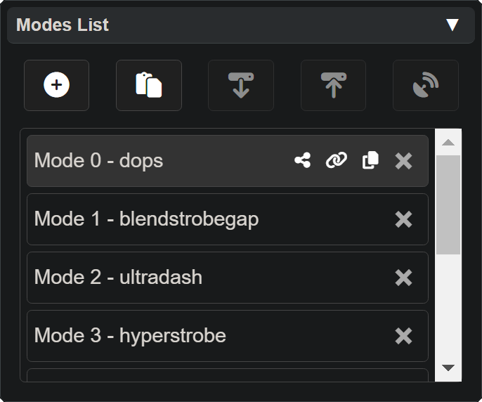

# Device Controls

The **Device Controls Panel** is very simple, offering only two purposes: to **select** or **connect** a **device**.

- **Select** a device when you want to make a mode for that type of device without needing to connect it.
- **Connecting** a device will automatically select the correct type from the device list.

In both cases, whether **Selecting** or **Connecting** a device, the **LED Selection Panel** will appear.

## Mobile Device Panel

On mobile (Android) the device panel is different, instead of a USB icon there will be a Bluetooth icon.

To see instructions for connecting devices via Bluetooth on Android see [Getting Started on Android](lightshow_lol_getting_started_mobile.html)

## Other Panels

  <a href="lightshow_lol_modes.html" class="panel-link">
    🔗 Modes Panel →
    
  </a>
    <a href="lightshow_lol_led_selection.html" class="panel-link">
    ← LED Selection Panel 🔗
    
  </a>

