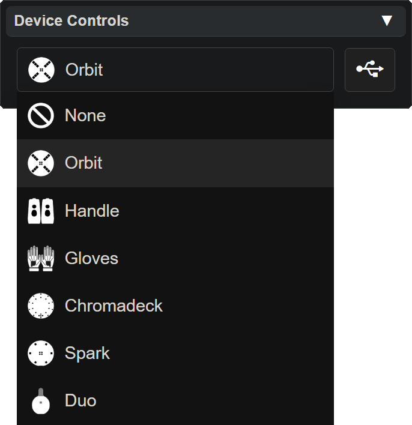

<!-- 

  <h1 style="color:orange;">⚠ <b style="color:yellow;">This page is under construction</b> ⚠ </h1>

 -->

# Lightshow.lol

This page details how to use the web-based Vortex Editor [lightshow.lol](https://lightshow.lol). 

## Basics

Lightshow.lol is an online tool that allows you to design, preview, and export custom [modes](modes.html) for any Vortex devices. 

The lightshow preview is the main focus of the page, with various control panels serving to modify the pattern, colorset, and preview animation.

{: .warning }
Although the preview is an exact simulation of a real device, due to the difference in the way color is produced by LEDs and displays **the preview will never look exactly the same as real LEDs**

### What is a Vortex Editor

In the **Vortex Engine** ecosystem a [mode](modes.html) consists of a [pattern](patterns.html) and a [colorset](colorsets.html) for each LED on a device.

For example, the **Spark Orbit** has **6 LEDs** which means **6 Patterns** and **6 Colorsets** -- one for each LED.

A **Vortex Editor** is any kind of software designed to edit the **Patterns** or **Colorsets** in the **Modes** of a **Vortex Device**.

### Panel Breakdown
In order to get familiar with how lightshow.lol works it is important to first familiarize yourself with each UI Panel.

Select one of the Panels below to learn more about it:

  <a href="lightshow_lol_animation.html" class="panel-link">
    🔗 Animation Panel →
    
  </a>
  <a href="lightshow_lol_device_controls.html" class="panel-link">
    🔗 Device Control →
    
  </a>
  <a href="lightshow_lol_modes.html" class="panel-link">
    🔗 Modes Panel →
    
  </a>
  <a href="lightshow_lol_led_selection.html" class="panel-link">
    🔗 Led Selection →
    
  </a>
  <a href="lightshow_lol_pattern.html" class="panel-link">
    🔗 Pattern Panel →
    
  </a>
  <a href="lightshow_lol_colorset.html" class="panel-link">
    🔗 Colorset Panel →
    
  </a>
  <a href="lightshow_lol_color_picker.html" class="panel-link">
    🔗 Color Picker →
    
  </a>
  <a href="lightshow_lol_update_panel.html" class="panel-link">
    🔗 Update Panel →
    
  </a>
  <a href="lightshow_lol_chromalink_duo.html" class="panel-link">
    🔗 Chromalink Panel →
    
  </a>

### Example Workflows

Once you're satisfied with your understanding of the UI Panels then read the example workflows at the bottom of this page.

To use Lightshow.lol with

