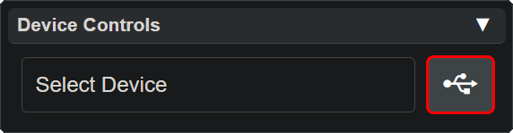

# Using a Vortex Device with Lightshow.lol

Welcome to Lightshow.lol, our powerful Vortex Engine mode designing tool. If you’re new or recently acquired a vortex device then you might be wondering:
- *How does this work?*
- *How do I get started?*

This guide will walk you through the basics and help familiarize you with the platform.

## **Connecting Your Device**
While it’s not necessary to connect a device to Lightshow.lol to start designing new modes, chances are you already own a **Vortex Device** and are eager to start customizing it! 

1. Find a **data-capable USB cable**.
2. Use it to connect your device to your computer.

    
    
    

## **Opening the Device Control Panel**
Once connected, follow these steps:

  

    
Go to the <a href="lightshow_lol_device_controls.html">Device Control Panel</a> in the <b>upper right corner</b> of Lightshow.lol.

    <ul>
      <li>No need to select a device first!</li>
      <li>Simply <b>click the USB button</b> on the right side of this panel to open the device port list.</li>
    </ul>
  

  

## **Selecting the Correct Port**

  
  

    
In the <b>device port list</b>, you may see multiple ports:

    <ul>
      <li>Select the one called <b>"JTAG/serial debug unit (COM__)"</b></li>
      <li>Click <b>Connect</b> to proceed.</li>
      <li>The number after COM will be different for each user.</li>
    </ul>
  

## **Successful Connection & Firmware Update**
If everything is set up correctly, you should see a **successful connection notification**, and the **firmware update panel** will open.

**Always update your firmware** if a newer version is available!

  

    
    
  

## What to do next

Frome here, s common next step is to [load the savefile](pulling_modes.html) from your device to lightshow.lol in order to edit it.

If you want to start from scratch instead you can try [creating new modes](creating_modes.html).

Instead of creating your own modes, there are many [community built modes](community.html) you can choose from to add to your device.

Try any combination of these options to create the ultimate device for you!

