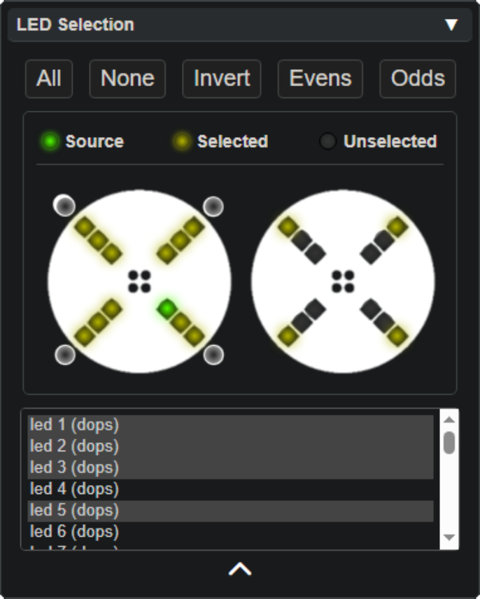

# LED Selection Panel

The **LED Selection Panel** allows you to select and modify individual LEDs settings for each mode on your device.

### Key Features

- **Visual Interface:** Displays a layout of all LEDs on the selected device.
- **Individual Customization:** Select individual LEDs to assign patterns and colors.
- **Batch Selection:** Select multiple LEDs for simultaneous modifications.

The LED Selection panel only appears after a device has been selected or connected from the [Device Control Panel](lightshow_lol_device_controls.html).

Led selections can be added or removed by holding shift or ctrl respectively, and you can group select by clicking and dragging your cursor to draw selection box over the image.

## Other Panels

  <a href="lightshow_lol_modes.html" class="panel-link">
    ← Modes Panel 🔗
    
  </a>
  <a href="lightshow_lol_pattern.html" class="panel-link">
    🔗 Pattern Panel →
    
  </a>

