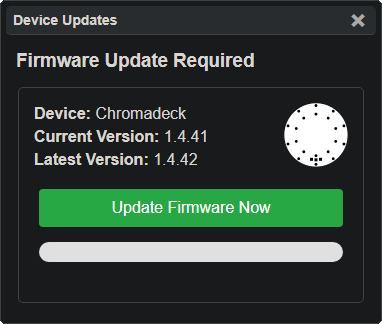
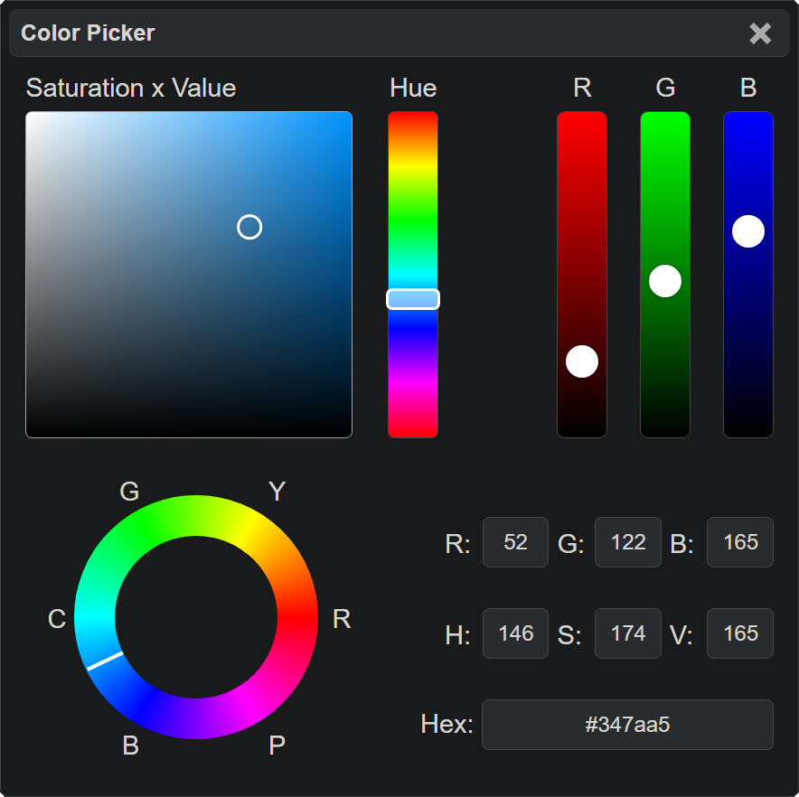
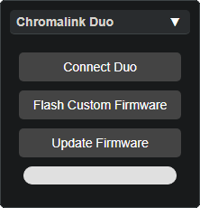

# Device Updates

The **Device Update Panel** is responsible for checking and delivering updates for the Spark Orbit, Spark Handles, and the Chromadeck.

### Key Features

- **Realtime Update Check:** Checks with the database on vortex.community for latest firmware version
- **Instant Firmware Flash:** Immediately update the firmware to the latest with the click of a button
- **Up-to-date Notification:** This window will inform if the firmware is completely up to date

The other devices like Vortex Orbit, Handles and Wired Gloves are not supported by this update panel.

## Other Panels

  <a href="lightshow_lol_color_picker.html" class="panel-link">
    ← Color Picker 🔗
    
  </a>
  <a href="lightshow_lol_chromalink_duo.html" class="panel-link">
    🔗 Chromalink Panel →
    
  </a>

