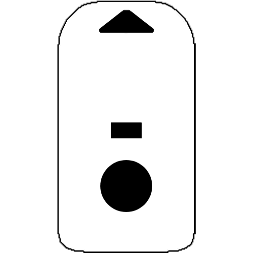
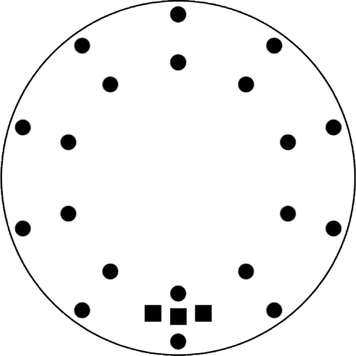
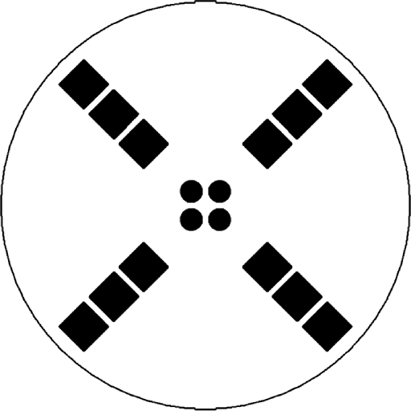
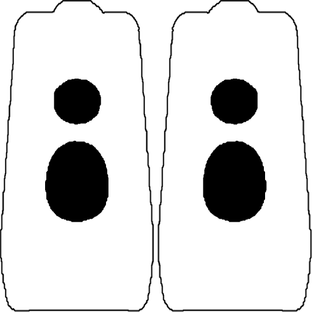

{: .warning }
This page is under construction and may have some small mistakes, apologies and thank you for your patience while we work to update this section

# Mode Sharing Menu

The Mode Sharing menu allows wirelessly sending and receiving of modes from one Vortex Device to another. Depending on the device, there are slightly different capabilities of modesharing.

Some Mode Sharing uses **Visible Light** and some uses **Infrared Light**, visible light is slower and more error prone but more suitable for small hardware.

## Device Specific Details

Read one of the guides below to learn about Mode Sharing on each device

  <h2>Duo</h2>
  
The Duo only uses Visible Light mode sharing, optimized for its compact size.

  

    <a class="device-card" href="mode_sharing_menu_duo.html">
      
      
Duo

    </a>
  

  <h2>Next-Gen Hybrid Devices</h2>
  
These newer devices are a hybrid design that fully support both Visible Light and Infrared.

  

    <a class="device-card" href="mode_sharing_menu_nextgen.html">
      
      
Spark Orbit

    </a>
    <a class="device-card" href="mode_sharing_menu_nextgen.html">
      
      
Spark Handle

    </a>
    <a class="device-card" href="mode_sharing_menu_nextgen.html">
      
      
Chromadeck

    </a>
  

  <h2>Legacy Infrared Devices</h2>
  
These older devices only support Infrared and Visible Light sending, they lack Visible Light receivers.

  

    <a class="device-card" href="mode_sharing_menu_legacy.html">
      
      
Vortex Orbit

    </a>
    <a class="device-card" href="mode_sharing_menu_legacy.html">
      
      
Handles

    </a>
    <a class="device-card" href="mode_sharing_menu_legacy.html">
      
      
Gloves

    </a>
  

