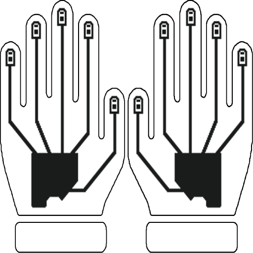

# Mode Sharing on Legacy Devices

  

    
    
Orbit

  

  

    
    
Handles

  

  

    
    
Gloves

  

Legacy devices like the **Orbit**, **Handle**, and **Wired Gloves** use **Infrared** (IR) for Mode Sharing. These devices **do not support receiving Visible Light**, but they **can send** Visible Light with their LEDs.

---

## Sharing Capabilities

- **Infrared Only**  
  These devices use IR for wireless mode transfers. 

- **VL Sending via USB**  
  When connected to [lightshow.lol](https://lightshow.lol), these devices can send **Visible Light transfers** to a Duo using the on-screen transmit button.

- **Cannot receive Visible Light**
  These devices are not equipped with Visible Light sensors and so cannot receive mode transfers from [Duos](duo_guide.html)

---

## Mode Sharing Menu

Enter the Mode Sharing menu by cycling to cyan and long clicking.

### Sending a Mode

1. **Pick a Mode**  
   Navigate to the mode you want to share and hold the button until LEDs flash white.

2. **Enter Mode Sharing**  
   Cycle to cyan and long click.

3. **Switch to Send Mode**  
   Short click once — the LED will blink cyan.

4. **Send the Mode**  
   Align devices button-to-button and hold steady during transmission.

5. **Exit**  
   Long click to leave the menu when done.

### Receiving a Mode

1. **Pick a Slot to Overwrite**  
   Navigate to the mode you want to replace and hold until LEDs flash white.

2. **Enter Mode Sharing**  
   Cycle to cyan and long click.

3. **Wait in Receive Mode**  
   The LED will be dim cyan by default. Hold the receiver button-to-button with the sender.

4. **Auto-Save and Exit**  
   Once received, the mode is saved and the menu exits automatically.

---

## Tips for Best Results

- **Use Button-to-Button Alignment** — both the IR emitter and receiver are just beneath the button.
- **Hold Steady and Close** — IR requires close, stable alignment with no gaps or shifts.

