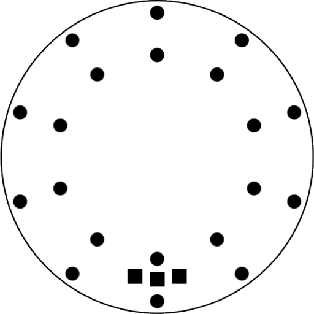

# Mode Sharing on NextGen Devices

  

    
    
Spark Orbit

  

  

    
    
Spark Handle

  

  

    
    
Chromadeck

  

NextGen devices — including the **Spark Orbit**, **Spark Handle**, and **Chromadeck** — support both **Visible Light** (VL) and **Infrared** (IR) Mode Sharing. These devices are compatible with Duos, IR devices, and each other.

## Sharing Capabilities

- **Visible Light (VL)**  
  Has both the faster 2025 Visible Light protocol, and the old Visible Light protocol.  Compatible with Duos and other NextGen devices.

- **Infrared (IR)**  
  Compatible with Orbit, Handle, Gloves, and other NextGen devices.

## Mode Sharing Menu

When you enter the Mode Sharing menu (cyan), use **short clicks** to cycle through:

1. **Send / Receive VL**  
   (LED color: teal) — new protocol

2. **Send / Receive IR**  
   (LED color: cyan) — for legacy IR devices

3. **Exit**  
   (LED color: blinking red) — leave the menu

Use a **long click** to activate the selected option.

----

### Sending a Mode (Infrared)

1. **Choose a Mode**  
   Navigate to the mode you want to send and hold the button until LEDs flash white.

2. **Enter Mode Sharing**  
   Cycle to cyan and long click.

3. **Select Protocol**  
   Use Send / Receive Infrared (Cyan)  

4. **Start Sending**  
   Short click to begin broadcasting.  
   Align devices **button-to-button**

5. **Exit**  
   Short click to select Exit, long click to leave the menu when done.

### Receiving a Mode

1. **Choose a Slot to Overwrite**  
   Navigate to the slot to replace and hold the button until LEDs flash white.

2. **Enter Mode Sharing**  
   Cycle to cyan and long click.

3. **Select Protocol**  
   Use Send / Receive Infrared (Cyan)  

4. **Wait for Sender**  
   Hold the devices **button-to-button** and keep steady.  
   The receiving device will save the mode and automatically exit the menu after a successful transfer.

----

### Sending a Mode (Visible Light)

1. **Choose a Mode**  
   Navigate to the mode you want to send and hold the button until LEDs flash white.

2. **Enter Mode Sharing**  
   Cycle to cyan and long click.

3. **Select Protocol**  
   Use Send / Receive VL (teal)  

4. **Start Sending**  
   Short click to begin broadcasting.  
   Align devices **button-to-button**

5. **Exit**  
   Short click to select Exit, long click to leave the menu when done.

### Receiving a Mode

1. **Choose a Slot to Overwrite**  
   Navigate to the slot to replace and hold the button until LEDs flash white.

2. **Enter Mode Sharing**  
   Cycle to cyan and long click.

3. **Select Protocol**  
   Use Send / Receive VL (teal)  

4. **Wait for Sender**  
   Hold the devices **button-to-button** and keep steady.  
   The receiving device will save the mode and automatically exit the menu after a successful transfer.

---

## Tips for Best Results

- **Use Button-to-Button Alignment** — sender LED and receiver sensor are located just under the button.
- **Match Protocols** — both devices must be in the same mode (VL or IR).