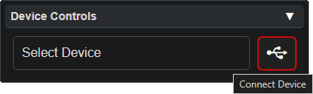

# Spark Upgrade Guide

This page details how to update the firmware on the Vortex Spark.

It is important to keep the Spark up to date to avoid bugs and use the latest safety fixes.

- **Use a data-capable USB cable, power-only cables won't work.**
- Windows will notify upon successful connection
- Mac may work but is not officially supported.

 - With the Spark plugged in, navigate a **Google Chrome** browser to [lightshow.lol](https://lightshow.lol) and click the **Connect Device** USB icon:

  
<b>Note:</b>
  Other browsers may work if they support <a href="https://developer.mozilla.org/en-US/docs/Web/API/Web_Serial_API#browser_compatibility">WebSerial</a>

  

 - Chrome will popup a new window, select 'USB JTAG/serial debug unit' from the list

  

 - Once the spark is connected the UI should look like this, simply hit 'Update Firmware Now' in the Device Updates panel:

  
<b>NOTE</b>: Ignore the 'Update Firmware' in the Chromalink Duo panel!

  

 - Let the firmware flash complete, unplug the Spark, then flip the power switch to check that it turns on
 
 - Cycle through all of the modes to verify the flash was successful

## Troubleshooting

**It doesn't work!**
If you encounter any other issues, try refreshing to page and unplugging and reconnecting your spark. Although it shouldn't be necessary, make sure the power switch is in the ON position while it is plugged in.

**It still doesn't work!**
Join our [discord](https://discord.gg/4R9at8S8Sn) and ask for help!
