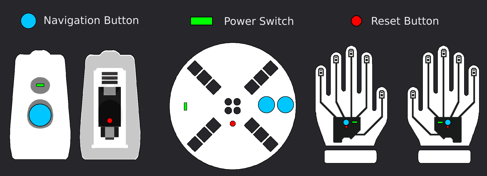

# Upgrade Guide

Start by connecting your device to the PC via USB.

**Use a data-capable USB cable, power-only cables won't work.**

When connected, you'll receive a Windows 'new connection' notification, indicating a successful connection.

Double click the reset button on your device. 

You will see a new drive appear on your PC, open this drive like a folder

Visit the Vortex Community [downloads page](https://vortex.community/downloads) in your browser.

## Upgrading a Device

