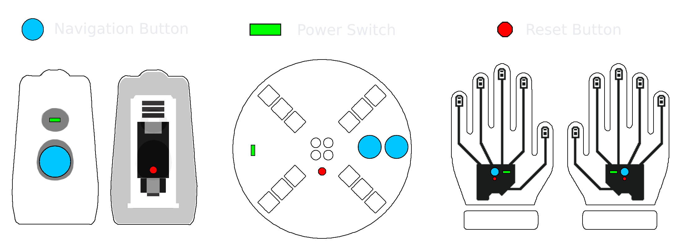

# Upgrade Guide

 1. Start by connecting your device to the PC via USB.

- **Use a data-capable USB cable, power-only cables won't work.**
- Windows will notify upon successful connection
- Mac may work but is not officially supported.

 2. Double click the reset button and a new drive should appear, this may take a few tries.

  

 3. Drag & Drop your device firmware file into the Trinketboot drive to automatically upgrade the firmware.

The latest firmware for your device can be found on the Vortex Community [downloads page](https://vortex.community/downloads).
