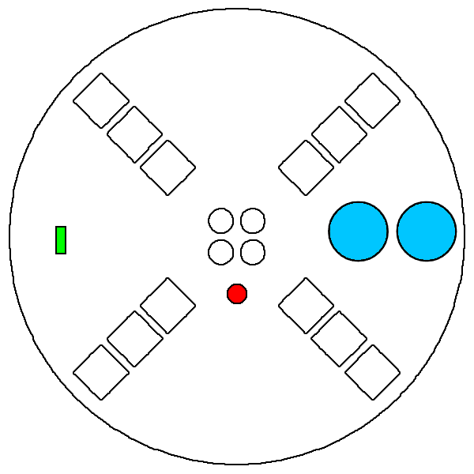

# Vortex Devices

The Votex Engine is a open-source project designed to drive LEDs with microcontrollers. These are the products currently built to run the Vortex Engine with more to come in the future as it continues to grow.

  

    <h1 style="margin: 0;">Spark Orbit</h1>
    
The Spark Orbit is a versatile 6-LED, rechargeable orbit. It is designed to pair seamlessly with Spark Handles and is compatible with all other Vortex devices.

    <ul>
      <li><a href="getting_started.html">Getting Started Spark Orbit</a></li>
      <li><a href="Spark_Orbit_guide.html">Spark Orbit Guide</a></li>
    </ul>
  

  

  

    <h1 style="margin: 0;">Spark Handle</h1>
    
The Spark Orbit is a versatile 6-LED, rechargeable handle. It is designed to pair with the Spark Orbit and is compatible with all other Vortex devices.

    <ul>
      <li><a href="getting_started.html">Getting Started Spark Handle</a></li>
      <li><a href="Spark_Handle_guide.html">Spark Handle Guide</a></li>
    </ul>
  

  

  

    <h1 style="margin: 0;">Chromadeck</h1>
    
The Chromadeck is a customizable LED deck for storing dozens of modes from any Vortex Engine device. When combined with the Chromalink accessory, it adds computer compatibility and the ability to update Duos.

    <ul>
      <li><a href="getting_started.html">Getting Started Chromadeck</a></li>
      <li><a href="Chromadeck_guide.html">Chromadeck Guide</a></li>
    </ul>
  

  

  

    <h1 style="margin: 0;">Duo</h1>
    
A multipurpose LED device. It's small form-factor and light weight makes it highly versitile allowing it to be used in any applications that call for rechargable LEDs, including orbiting.

    <ul>
      <li><a href="getting_started.html">Getting Started Duo</a></li>
      <li><a href="duo_guide.html">Duo Guide</a></li>
    </ul>
  

  

  

    <h1 style="margin: 0;">Vortex Orbit</h1>
    
The Vortex Orbit is a cutting-edge device for advanced lighting effects and performance.

    <ul>
      <li><a href="getting_started_classic_devices.html">Getting Started Vortex Orbit</a></li>
      <li><a href="orbit_guide.html">Vortex Orbit Guide</a></li>
    </ul>
  

  

  

    <h1 style="margin: 0;">Omega Handle</h1>
    
The Omega Handle is a robust device designed for precise light control.

    <ul>
      <li><a href="getting_started_classic_devices.html">Getting Started Omega Handle</a></li>
      <li><a href="handles_guide.html">Omega Handle Guide</a></li>
    </ul>
  

  

  

    <h1 style="margin: 0;">Vortex Glove</h1>
    
The Vortex Glove is an innovative device for creating interactive lighting effects.

    <ul>
      <li><a href="getting_started_classic_devices.html">Getting Started Glove</a></li>
      <li><a href="gloves_guide.html">Vortex Glove Guide</a></li>
    </ul>
  

  

